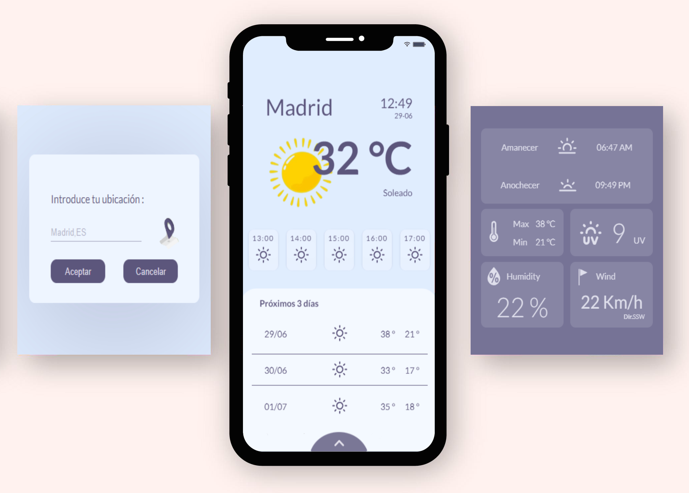

# Weather APP

Aplicación basada en la previsión meteorológica que recoge los datos de la API [Weatherapi.com](https://www.weatherapi.com/).

Proporciona información sobre el tiempo actual, la previsión para las próximas cinco horas, información general de los próximos dos días, hora de la salida y puesta de sol, radiación UV, viento y velocidad...

La previsión se muestra con iconos sencillos de forma interactiva según la locaclización que inserte el usuario.

## Acceso 
---
Para acceder a la aplicación es necesaria su descarga, ya que la API de la cual obtiene los datos de HTTP en lugar de HTTPS.